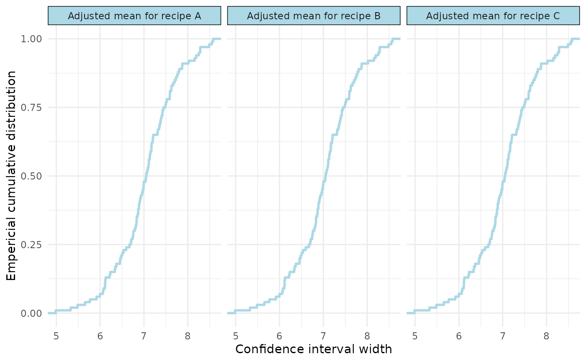
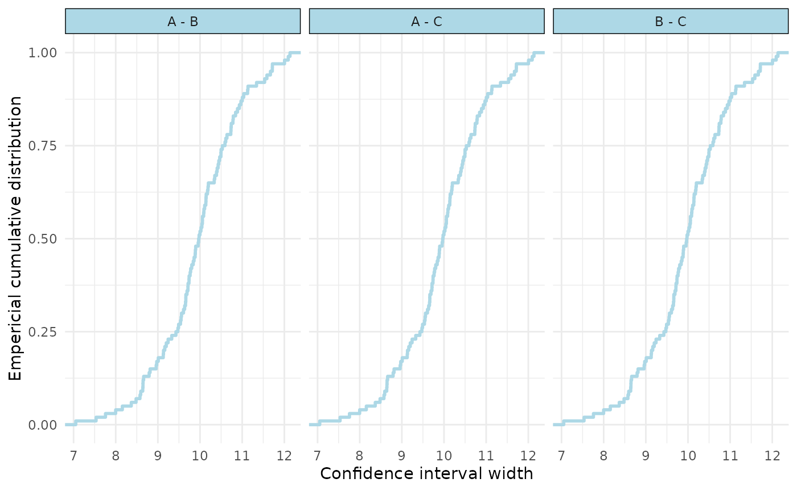

# Custom estimand functions: means and contrasts

## Load the package

``` r

library(precisionSim)
```

## Create a model

We’ll use the sleepstudy data from the `lme4` package, and create a very
simple model. In practice, this could be pilot data or from another
(related) study.

``` r

#get data
data_cake <- lme4::cake

#create model
model_cake <- lme4::lmer(angle ~ recipe + temp + (1 | recipe:replicate), data = data_cake)
```

## Marginal means

In the first instance, we demonstrate a function that estimates the
marginal means and 95%CI using the `emmeans` package.

The package expects a function that takes the lme4 model as an input,
and produces a data.frame with columns for ‘estimand’, ‘estimate’,
‘lower’, and ‘upper’. Here, we just do so for the beta coefficient for
‘Task’:

``` r

#marginal means function
recipe_means <- function(fitted_model) {
  
  marginal_means <- emmeans::emmeans(fitted_model, specs = ~ recipe)
  
  ci <- as.data.frame(stats::confint(marginal_means, level = 0.95))
  
  data.frame(
    estimand = paste("Adjusted mean for recipe", ci$recipe),
    estimate = ci$emmean,
    lower = ci$lower.CL,
    upper = ci$upper.CL
  )
}
```

We can quickly test this function as follows:

``` r

recipe_means(model_cake)
#>                     estimand estimate    lower    upper
#> 1 Adjusted mean for recipe A 33.12222 29.61715 36.62729
#> 2 Adjusted mean for recipe B 31.64444 28.13937 35.14952
#> 3 Adjusted mean for recipe C 31.60000 28.09493 35.10507
```

### Run the simulations

As usual, we’ll run 100 simulations for simplicity and efficiency, but
for the real thing, do more (e.g., 5000).

``` r

#run precision simulation
sim1 <- precisionSim(
  fit = model_cake,
  interval_fun = recipe_means,
  target_width = c(5, 7, 9),
  nsim = 100,
  seed = 123
)
#> Registered S3 method overwritten by 'car':
#>   method           from
#>   na.action.merMod lme4

#summary
summary(sim1)
#> Precision analysis by simulation
#> ===============================
#> 
#> Model: angle ~ recipe + temp + (1 | recipe:replicate) 
#> Simulations requested: 100 
#> Target probability: 80 %
#> Monte Carlo confidence level: 95 %
#> 
#>  Estimand                   Width Assurance Monte Carlo CI
#>  Adjusted mean for recipe A 5     1%        0.03%, 5.45%  
#>  Adjusted mean for recipe A 7     48%       37.9%, 58.22% 
#>  Adjusted mean for recipe A 9     100%      96.38%, 100%  
#>  Adjusted mean for recipe B 5     1%        0.03%, 5.45%  
#>  Adjusted mean for recipe B 7     48%       37.9%, 58.22% 
#>  Adjusted mean for recipe B 9     100%      96.38%, 100%  
#>  Adjusted mean for recipe C 5     1%        0.03%, 5.45%  
#>  Adjusted mean for recipe C 7     48%       37.9%, 58.22% 
#>  Adjusted mean for recipe C 9     100%      96.38%, 100%  
#> 
#> Diagnostics:
#>   Failed fits: 0 
#>   Non-converged fits: 0 
#>   Singular fits: 0 
#>   Interval failures: 0 
#> 
#> Elapsed time: 8.535
```

### Visualise

We can visualise our results in two ways: 1) “assurance” which should a
ecdf, and 2) “distribution” which shows a histogram of the simulated
widths.

``` r

#visualise
plot(sim1, type="assurance")
```



### Determine width at pre-specified assurance

We can also take our results, and determine with confidence interval
width at a pre-specified assurance probability.

``` r

#determine widths at 50%, 75% and 90% assurance levels
quantile(sim1, prob = c(0.5, 0.75, 0.9))
#>                                 50%      75%      90%
#> Adjusted mean for recipe A 7.051371 7.456507 7.870148
#> Adjusted mean for recipe B 7.051371 7.456507 7.870148
#> Adjusted mean for recipe C 7.051371 7.456507 7.870148
```

## Pairwise contrast

Now we’ll demonstrate pairwise contrasts, again using the `emmeans`
package.

``` r

#pairwise contrast function
recipe_pairwise <- function(fitted_model) {
  
  comparisons <- emmeans::emmeans(fitted_model, pairwise ~ recipe,adjust = "none")
  
  ci <- as.data.frame(stats::confint(comparisons$contrasts,level = 0.95,adjust = "none"))
  
  data.frame(
    estimand = ci$contrast,
    estimate = ci$estimate,
    lower = ci$lower.CL,
    upper = ci$upper.CL
  )
}

#test
recipe_pairwise(model_cake)
#>   estimand   estimate     lower    upper
#> 1    A - B 1.47777778 -3.479142 6.434698
#> 2    A - C 1.52222222 -3.434698 6.479142
#> 3    B - C 0.04444444 -4.912475 5.001364
```

### Run the simulations

``` r

#run precision simulation
sim2 <- precisionSim(
  fit = model_cake,
  interval_fun = recipe_pairwise,
  target_width = c(7, 9, 11),
  nsim = 100,
  seed = 123
)

#summary
summary(sim2)
#> Precision analysis by simulation
#> ===============================
#> 
#> Model: angle ~ recipe + temp + (1 | recipe:replicate) 
#> Simulations requested: 100 
#> Target probability: 80 %
#> Monte Carlo confidence level: 95 %
#> 
#>  Estimand Width Assurance Monte Carlo CI
#>  A - B     7    0%        0%, 3.62%     
#>  A - B     9    17%       10.23%, 25.82%
#>  A - B    11    87%       78.8%, 92.89% 
#>  A - C     7    0%        0%, 3.62%     
#>  A - C     9    17%       10.23%, 25.82%
#>  A - C    11    87%       78.8%, 92.89% 
#>  B - C     7    0%        0%, 3.62%     
#>  B - C     9    17%       10.23%, 25.82%
#>  B - C    11    87%       78.8%, 92.89% 
#> 
#> Diagnostics:
#>   Failed fits: 0 
#>   Non-converged fits: 0 
#>   Singular fits: 0 
#>   Interval failures: 0 
#> 
#> Elapsed time: 8.655
```

### Visualise

``` r

#plot
plot(sim2)
```



### Determine width at pre-specified assurance

``` r

#check different assurance probabilities
quantile(sim2, prob = c(0.50, 0.80, 0.95))
#>            50%      80%      95%
#> A - B 9.972144 10.73615 11.67283
#> A - C 9.972144 10.73615 11.67283
#> B - C 9.972144 10.73615 11.67283
```

## Adjusting for covariates

In some instances, we may want our estimands to adjust for a covariate.
Here is an example function for an adjusted marginal mean.

``` r

recipe_means_at_200 <- function(fitted_model) {

  marginal_means <- emmeans::emmeans(fitted_model,specs = ~ recipe,at = list(temp = 200 ))

  ci <- as.data.frame(stats::confint(marginal_means,level = 0.95))

  data.frame(
    estimand = paste("Recipe", ci$recipe, "mean at 200"),
    estimate = ci$emmean,
    lower = ci$lower.CL,
    upper = ci$upper.CL
  )
}

#test
recipe_means_at_200(model_cake)
#>               estimand estimate    lower    upper
#> 1 Recipe A mean at 200 33.12222 29.61715 36.62729
#> 2 Recipe B mean at 200 31.64444 28.13937 35.14952
#> 3 Recipe C mean at 200 31.60000 28.09493 35.10507
```

The same could be done for pairwise contrasts or interaction models.
