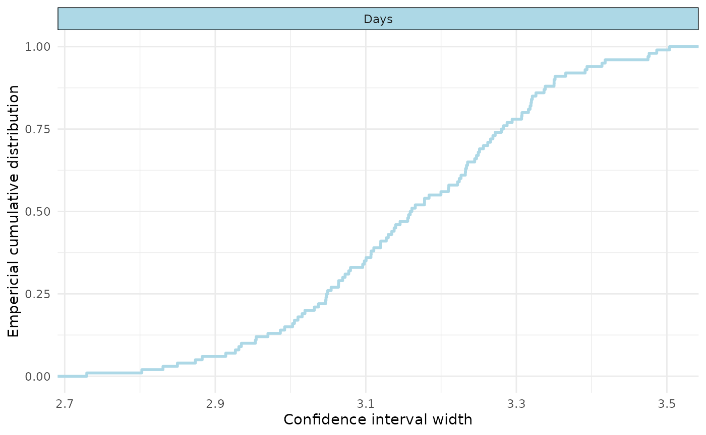
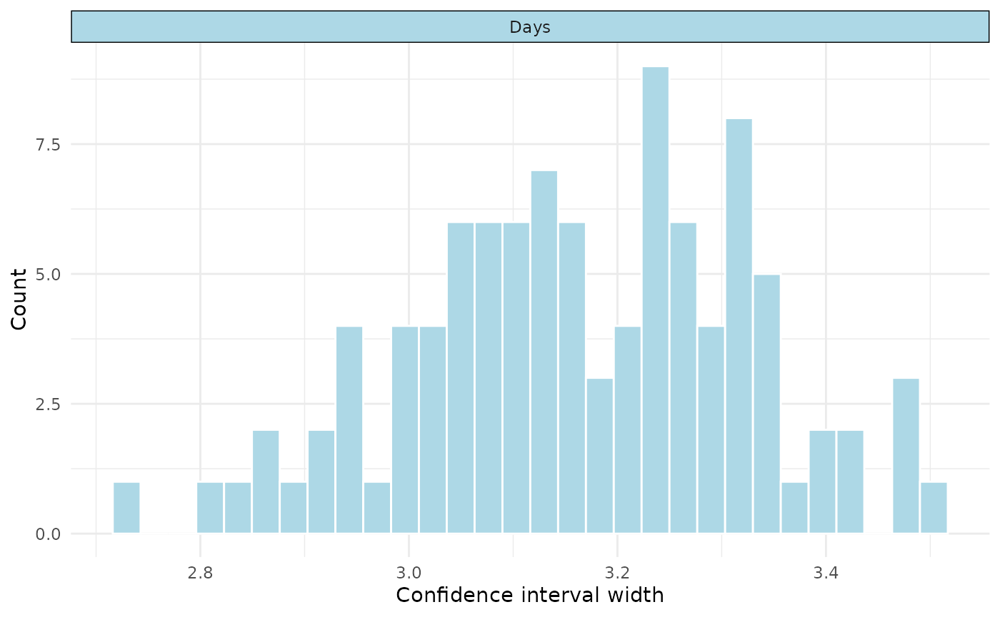

# Simulate confidence interval widths at pre-specified assurance

## Load the package

``` r

library(precisionSim)
```

## Create a model

We’ll use the sleepstudy data from the `lme4` package, and create a very
simple model. In practice, this could be pilot data or from another
(related) study.

``` r

#get data
data_sleep <- lme4::sleepstudy

#create model
mod1 <- lme4::lmer(Reaction ~ Days + (1|Subject), data = data_sleep)
```

## Create the interval function

We then need to create a custom function that take the lme4 model as an
input, and produces a data.frame with columns for ‘estimand’,
‘estimate’, ‘lower’, and ‘upper’. Here, we just do so for the beta
coefficient for ‘Task’:

``` r

#define function to get interval of interest
interval_function <- function(fitted_model){

  ci <- suppressMessages(confint(fitted_model))

  return(
    data.frame(
      estimand = "Days",
      estimate = lme4::fixef(fitted_model)[[2]],
      lower = ci[4,1],
      upper = ci[4,2]
    )
  )

}
```

We can quickly test this function as follows:

``` r

interval_function(mod1)
#>   estimand estimate    lower    upper
#> 1     Days 10.46729 8.886551 12.04802
```

Note that in this instance we only have one estimand, but multiple
estimands can be produced by adding more rows to our outputs data frame.

Other popular choices for estimands may be marginal means or pairwise
contrasts (e.g., derived from the `emmeans` package).

## Run the simulations

We’d normally run more than 100 simulations (e.g., 5000), but for
simplicity and efficiency we just run 100

``` r

#run 100 simulations for ease (should be higher for the real thing e.g., 5000)
sim1 <- precisionSim(mod1,
                     target_width = c(3,4,5), #different widths to test
                     interval_fun = interval_function, #our custom function
                     prob = 0.80, #assurance probability
                     mc_conf_level = 0.95, #monte carlo confidence level for our probability 
                     nsim = 100, #number of simulations, usually go higher (e.g., 5000)
                     seed = 123) #seed
#> Registered S3 method overwritten by 'car':
#>   method           from
#>   na.action.merMod lme4

#summary
summary(sim1)
#> Precision analysis by simulation
#> ===============================
#> 
#> Model: Reaction ~ Days + (1 | Subject) 
#> Simulations requested: 100 
#> Target probability: 80 %
#> Monte Carlo confidence level: 95 %
#> 
#>  Estimand Width Assurance Monte Carlo CI
#>  Days     3     15%       8.65%, 23.53% 
#>  Days     4     100%      96.38%, 100%  
#>  Days     5     100%      96.38%, 100%  
#> 
#> Diagnostics:
#>   Failed fits: 0 
#>   Non-converged fits: 0 
#>   Singular fits: 0 
#>   Interval failures: 0 
#> 
#> Elapsed time: 169.916
```

## Visualise

We can visualise our results in two ways: 1) “assurance” which should a
ecdf, and 2) “distribution” which shows a histogram of the simulated
widths.

``` r

#visualise
plot(sim1, type="assurance")
```



``` r

plot(sim1, type="distribution")
#> `stat_bin()` using `bins = 30`. Pick better value `binwidth`.
```



## Determine width at pre-specified assurance

We can also take our results, and determine with confidence interval
width at a pre-specified assurance probability.

``` r

#determine widths at 50%, 75% and 90% assurance levels
quantile(sim1, prob = c(0.5, 0.75, 0.9))
#>           50%      75%     90%
#> Days 3.160141 3.280826 3.35031
```
