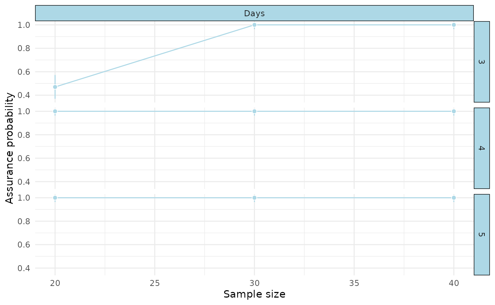
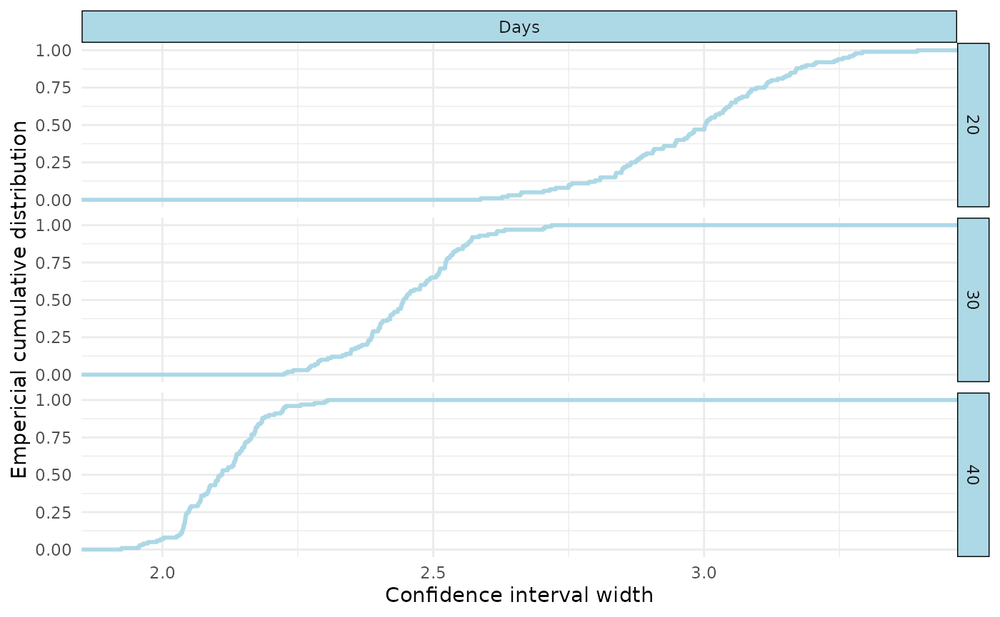
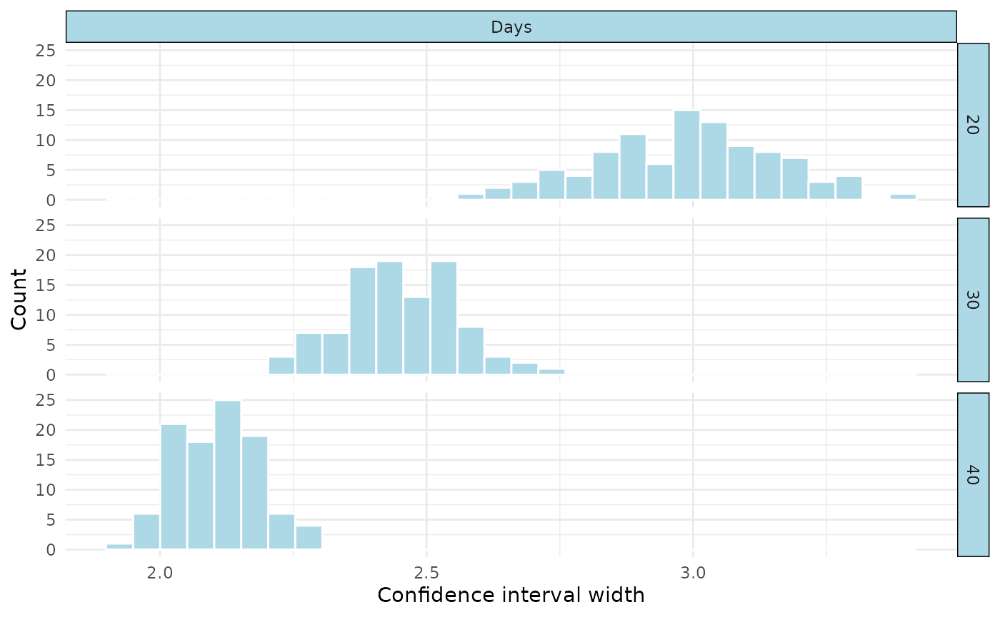

# Simulate confidence interval widths at multiple sample sizes

## Load the package

``` r

library(precisionSim)
```

## Create a model

We’ll again use the sleepstudy data from the `lme4` package, and create
a very simple model. In practice, this could be pilot data or from
another (related) study.

``` r

#get data
data_sleep <- lme4::sleepstudy

#create model
mod1 <- lme4::lmer(Reaction ~ Days + (1|Subject), data = data_sleep)
```

## Create the extended model

We can use the
[`simr::extend()`](https://rdrr.io/pkg/simr/man/extend.html) to increase
the sample size of our model to n=50:

``` r

mod_extended <- simr::extend(mod1, along = "Subject", n = 40)
#> Registered S3 method overwritten by 'car':
#>   method           from
#>   na.action.merMod lme4
```

## Create the interval function

We then need to create a custom function that take the lme4 model as an
input, and produces a data.frame with columns for ‘estimand’,
‘estimate’, ‘lower’, and ‘upper’. Here, we just do so for the beta
coefficient for ‘Task’:

``` r

#define function to get interval of interest
interval_function <- function(fitted_model){

  ci <- suppressMessages(confint(fitted_model))

  return(
    data.frame(
      estimand = "Days",
      estimate = lme4::fixef(fitted_model)[[2]],
      lower = ci[4,1],
      upper = ci[4,2]
    )
  )

}
```

We can quickly test this function as follows:

``` r

interval_function(mod1)
#>   estimand estimate    lower    upper
#> 1     Days 10.46729 8.886551 12.04802
```

Note that in this instance we only have one estimand, but multiple
estimands can be produced by adding more rows to our outputs data frame.

## Run the simulations

We’d normally run more than 100 simulations (e.g., 5000), but for
simplicity and efficiency we just run 100

``` r

#run 100 simulations for ease (should be higher for the real thing e.g., 5000)
sim1 <- precisionCurve(mod_extended,
                     target_width = c(3,4,5), #different widths to test
                     interval_fun = interval_function, #our custom function
                     along = "Subject", #variable were are simulating along
                     breaks = c(20, 30, 40), #number of levels of 'Subject' to simulate
                     prob = 0.80, #assurance probability
                     mc_conf_level = 0.95, #monte carlo confidence level for our probability 
                     nsim = 100, #number of simulations, usually go higher (e.g., 5000)
                     seed = 123) #seed

#summary
summary(sim1)
#> Precision analysis by simulation
#> ===============================
#> 
#> Model: Reaction ~ Days + (1 | Subject) 
#> Simulations requested: 100 
#> Target probability: 80 %
#> Monte Carlo confidence level: 95 %
#> 
#>  Estimand nlevels nrow Width Assurance Monte Carlo CI
#>  Days     20      200  3     47%       36.94%, 57.24%
#>  Days     20      200  4     100%      96.38%, 100%  
#>  Days     20      200  5     100%      96.38%, 100%  
#>  Days     30      300  3     100%      96.38%, 100%  
#>  Days     30      300  4     100%      96.38%, 100%  
#>  Days     30      300  5     100%      96.38%, 100%  
#>  Days     40      400  3     100%      96.38%, 100%  
#>  Days     40      400  4     100%      96.38%, 100%  
#>  Days     40      400  5     100%      96.38%, 100%  
#> 
#> Diagnostics:
#>   Failed fits: 0 
#>   Non-converged fits: 0 
#>   Singular fits: 0 
#>   Interval failures: 0 
#> 
#> Elapsed time: 615.264
```

You can see that once we hit n=30, our lowest confidence interval width
of 3 was achieved 100% of the time.

## Visualise

We can visualise our results in two ways: 1) “curve” which plot the
assurance probability (with its 95% monte carlo confidence intervals) at
each sample size, 2) “assurance” which should a ecdf, and 3)
“distribution” which shows a histogram of the simulated widths.

``` r

#visualise
plot(sim1, type="curve")
```



``` r

plot(sim1, type="assurance")
```



``` r

plot(sim1, type="distribution")
#> `stat_bin()` using `bins = 30`. Pick better value `binwidth`.
```



## Determine width at pre-specified assurance

We can also take our results, and determine with confidence interval
width at a pre-specified assurance probability for each simulated sample
size.

``` r

#determine widths at 50%, 75% and 90% assurance levels
quantile(sim1, prob = c(0.5, 0.75, 0.9))
#>   estimand nlevels prob    width
#> 1     Days      20 0.50 3.002244
#> 2     Days      20 0.75 3.100322
#> 3     Days      20 0.90 3.189454
#> 4     Days      30 0.50 2.445719
#> 5     Days      30 0.75 2.522921
#> 6     Days      30 0.90 2.569546
#> 7     Days      40 0.50 2.108813
#> 8     Days      40 0.75 2.164022
#> 9     Days      40 0.90 2.197490
```
